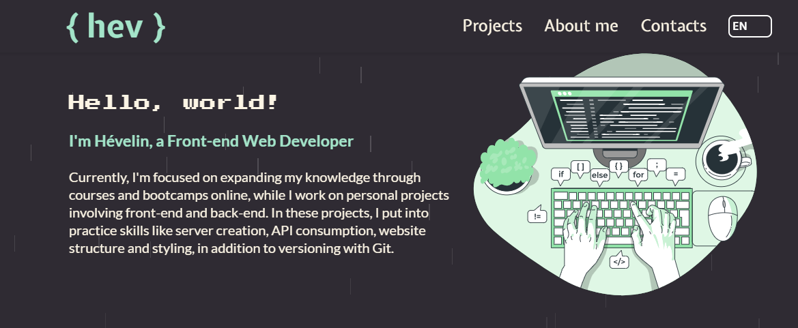

<h1 align="center"> Portfólio </h1>

<br>

<p align="center">
  
</p>
<p align="center">
  <em>Confira o resultado do app em: https://hev-elin.vercel.app/</em>
</p>

## 💻 Projeto

Código fonte utilizado para construir meu portfólio.

## 🛠️ Tecnologias Utilizadas

Este projeto foi desenvolvido com as seguintes tecnologias:

- HTML + CSS
- TypeScript
- React
- Styled-Components
- Git e Github

## Execução do projeto

- Passo 1: Clone este repositório.

```bash
git clone https://github.com/hevelinlima/portfolio.git
```

- Passo 2: Navegue até o Diretório do Projeto:

```bash
cd portfolio
```

- Passo 3: Instale as Dependências:

  - Certifique-se de ter o Node.js e npm (ou yarn) instalados em sua máquina.
  - Instale as dependências do projeto executando:

  ```bash
  npm install
  ```

  ou

  ```bash
  yarn install
  ```

- Passo 4: Execute o Projeto:

Para iniciar o servidor de desenvolvimento, execute:

```bash
npm run dev
```

ou

```bash
yarn dev
```

---

Feito com ♥ by hevelinlima
